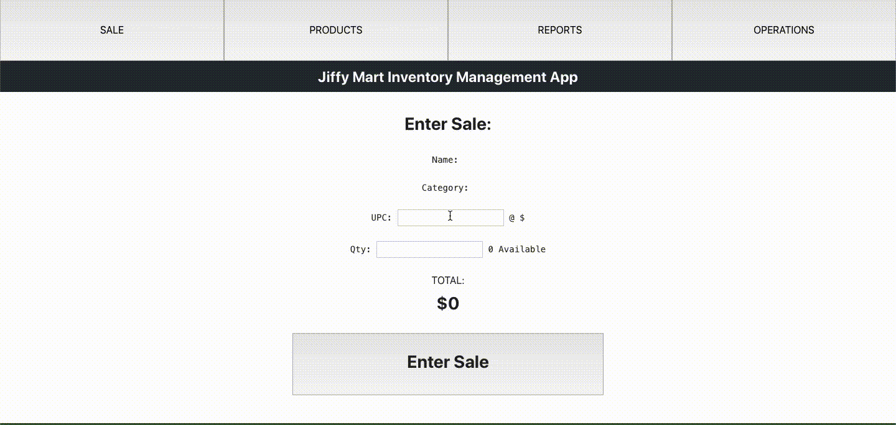

# CRUD Inventory Management Tool

## Technologies
  React, MongoDB, Express, and Node

## Run Project

Client:    

cd CRUD-Inventory-Mgmt-Tool  

yarn add  

yarn run start  

Server:   

mongod (need Mongodb installed)  
cd backend/  
yarn add\  
yarn run dev  

Description:
------------

Open source Inventory Management/Point of Sale is a web based point of sale system written in React and MERN stack.

Current features are:

✅ Stock management  
✅ Sale register with transactions logging  

To-Do:
------
* Deploy to Netlify
* Expenses logging
* Reporting on sales, orders, expenses, inventory status
* Taxation
* Invoicing
* Receipt and invoice printing and/or emailing
* Barcode generation and printing
* Suppliers and Customers database
* Authentication and multiuser with permission control
* Receivings

The software is written in Javascript language, uses React Framework, MongoDB as data storage, and an Express back-end server for the REST API.

Demo:
-----
Products page:

Sales page:

